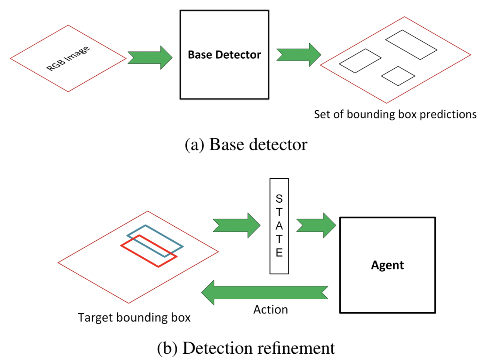
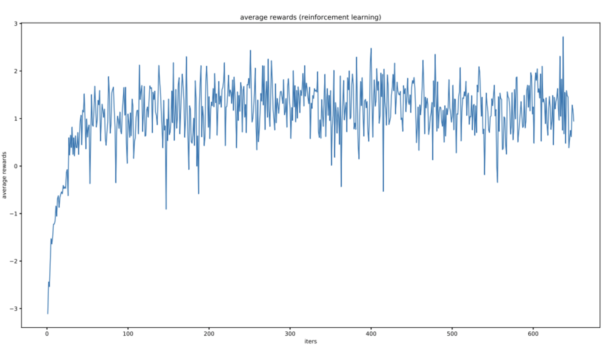

# ObjectDet-RL
Framework for Refining Object Detection with Reinforcement Learning
- [Framework](#Framework)
- [Usage](#usage)
- [Action](#Action)
- [Training](#Training)
- [Examples](#Examples)

## Framework

The framework have two essential components, a base detector, and an agent that is responsible for refining the detection generated by the base detector.

## Action
* action to move the box in the horizontal axes
* action to move the box in the vertical axes
* action to change the width of the box
* action to change the height of the box

## Training
Reinforcement learning with proximal policy optimization (PPO):

## Examples
* Before refinement: Object detection results from base detector, Faster-RCNN.

* After RL refinement: The final refined results from the reinforcement learning agent performing iterative refinement.

